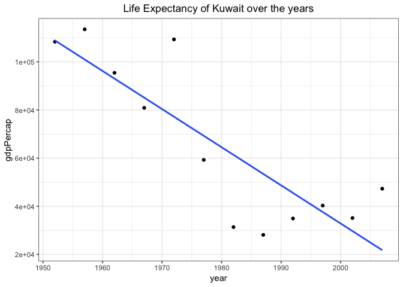
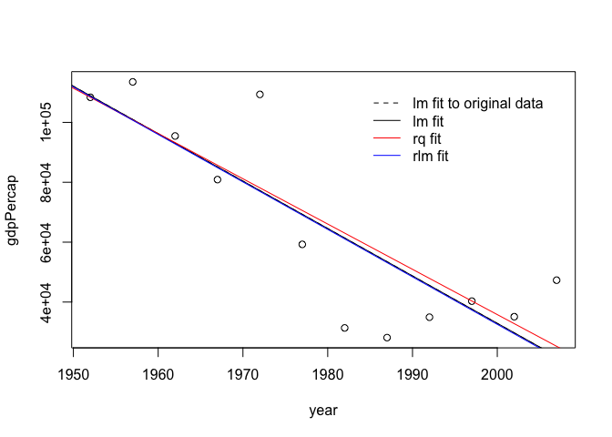
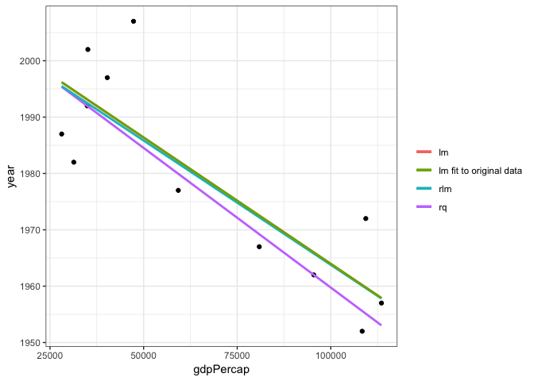

STAT545 Homework 06: Data Wrangling
================
Becky
2018-11-01

-   [Assignment Goals:](#assignment-goals)
-   [Assignment Activity 2: Writing functions](#assignment-activity-2-writing-functions)
-   [Function one](#function-one)

### Assignment Goals:

Assignment 6 covers concepts involved in working with non-numeric (character and factor) and covers the following [key areas](https://github.com/STAT545-UBC-students/hw06-rasiimwe):

1.  Writing R functions
2.  Working with regular expressions and character data
3.  Working with purrr, list-columns, nested data frames

#### Loading required packages

``` r
library(stringr) #avails string functions 
library(gapminder) #loading the Gapminder excerpt
library(ggplot2) #will be required to make some plots
library(dplyr)# for required data manipulation
library(quantreg)  #quantile regression
library(MASS)   
```

### Assignment Activity 2: Writing functions

> Question overview:

> Write one (or more) functions that do something useful to pieces of the Gapminder or Singer data. It is logical to think about computing on the mini-data frames corresponding to the data for each specific country, location, year, band, album, … This would pair well with the prompt below about working with a nested data frame, as you could apply your function there. Make it something you can’t easily do with built-in functions. Make it something that’s not trivial to do with the simple dplyr verbs. The linear regression function presented [here](http://stat545.com/block012_function-regress-lifeexp-on-year.html) is a good starting point. You could generalize that to do quadratic regression (include a squared term) or use robust regression, using MASS::rlm() or robustbase::lmrob().

### Function one

R provides several methods for robust regression, to handle data with outliers. This tutorial shows how to fit a data set with a large outlier, comparing the results from both standard and robust regressions. This also serves as a comparison of plotting with base graphics vs. ggplot2, and demonstrates the power of using ggplot2 to integrate analysis with visualization.

#### Creating dataframe to work with

``` r
ctry <- "Kuwait" 
(data <- gapminder %>% 
  filter(country == ctry))
```

    ## # A tibble: 12 x 6
    ##    country continent  year lifeExp     pop gdpPercap
    ##    <fct>   <fct>     <int>   <dbl>   <int>     <dbl>
    ##  1 Kuwait  Asia       1952    55.6  160000   108382.
    ##  2 Kuwait  Asia       1957    58.0  212846   113523.
    ##  3 Kuwait  Asia       1962    60.5  358266    95458.
    ##  4 Kuwait  Asia       1967    64.6  575003    80895.
    ##  5 Kuwait  Asia       1972    67.7  841934   109348.
    ##  6 Kuwait  Asia       1977    69.3 1140357    59265.
    ##  7 Kuwait  Asia       1982    71.3 1497494    31354.
    ##  8 Kuwait  Asia       1987    74.2 1891487    28118.
    ##  9 Kuwait  Asia       1992    75.2 1418095    34933.
    ## 10 Kuwait  Asia       1997    76.2 1765345    40301.
    ## 11 Kuwait  Asia       2002    76.9 2111561    35110.
    ## 12 Kuwait  Asia       2007    77.6 2505559    47307.

#### Ploting the data

``` r
data %>% 
  ggplot(aes(year, gdpPercap)) + 
  geom_point() + 
  geom_smooth(method = "lm", se = FALSE) +
  theme_bw() +
  ggtitle("Life Expectancy of Kuwait over the years") +
  theme( plot.title = element_text(hjust = 0.5))
```



#### Fitting a robust regression model (Getting some code that works)

``` r
fm.orig <- lm(gdpPercap ~ year, data=data) 

data$gdpPercap[5] <- 109347.87 #outlier - need to create an outlier point!
fm.lm <- update(fm.orig)
#Quantile regression: This models the median of gdpPercap as a function of year, rather than modelling the mean of gdpPercap as a function of year, in the case of least squares regression

fm.rq <- rq(gdpPercap ~ year, data=data)

#Iteratively re-weighted least squares fit: This down-weights outliers according to how far they are from the best-fit line, and iteratively re-fits the model until convergence is achieved 

fm.rlm <- rlm(gdpPercap ~ year, data=data)
```

Ploting the models compared to the least squares fit-plot all the model lines together for comparison.

``` r
plot(gdpPercap ~ year, data=data)
abline(fm.orig, lty="dashed")    # use a dashed line
abline(fm.lm)
abline(fm.rq, col="red")
abline(fm.rlm, col="blue")
legend("topright", inset=0.05, bty="n",
       legend = c("lm fit to original data", "lm fit", "rq fit", "rlm fit"),
       lty = c(2, 1, 1, 1),      # 1 = "solid" ; 2 = "dashed"
       col = c("black", "black", "red", "blue")
       )
```



Using ggplot to plot the data as well as fit and plot the regression line, with standard error confidence bounds displayed as a semi-transparent, shaded envelope (I have set mine to false). ggplot runs the 'lm' regression for us, including requesting standard errors on the predicted values, and plots the results as a line + envelope with an appropriate legend - NEAT!

By default, the fitting is applied separately to each specified "group" of data, which is identified in this case by the different colours & line types applied to each unique value of the "type" column in the supplied data frame (which is itself the concatenation by row of 2 separate data frames using 'rbind'):

``` r
data %>% 
  ggplot(aes(gdpPercap, year)) +                                  # use "outlier" data frame
  geom_point()+                                                   # } these all 
  geom_smooth(method="lm", aes(colour="lm"), se=FALSE)+           # }  automatically
  geom_smooth(method="rq", aes(colour="rq"), se=FALSE) +           # }  inherit 
  geom_smooth(method="rlm", aes(colour="rlm"), se=FALSE) +         # }  "data=outlier"
  geom_smooth(method="lm", data=data, aes(colour="lm fit to original data"), se=FALSE) +     
  labs(colour=NULL) +          # remove legend title
  theme_bw()
```


